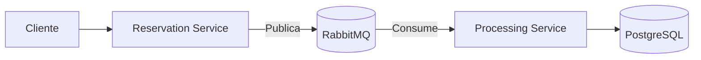

# Flight Reservations Microservices System ✈️

Sistema distribuido para gestión de reservas de vuelos usando arquitectura de microservicios con Spring Boot, RabbitMQ y PostgreSQL.

Este proyecto tiene como objetivo gestionar las reservas de vuelos mediante una arquitectura de microservicios. Incluye dos microservicios: un servicio de **reservas** y un servicio de **procesamiento**. Los servicios se comunican mediante colas de mensajería y se encargan de validar la entrada, procesar la reserva y almacenarla en una base de datos.

## 📌 Tabla de Contenidos
- [Propósito del Proyecto](#-propósito-del-proyecto)
- [Arquitectura del Sistema](#-arquitectura-del-sistema)
- [Tecnologías Utilizadas](#-tecnologías-utilizadas)
- [Instalación y Ejecución](#-instalación-y-ejecución)
- [Endpoints API](#-endpoints-api)
- [Configuración de Colas RabbitMQ](#-configuración-de-colas-rabbitmq)
- [Perfiles Spring](#-perfiles-spring)
- [Datos de Prueba](#-datos-de-prueba)
- [Estructura del Proyecto](#-estructura-del-proyecto)

## 🎯 Propósito del Proyecto

El proyecto se encarga de:

- Validar el formato y la existencia de la reserva antes de enviarla a la cola.
- Procesar las reservas de vuelo, confirmarlas y almacenarlas en la base de datos.
- Eliminarlas y consultar vuelos
- Utiliza colas para asegurar la correcta entrega y procesamiento de las reservas.

Sistema que permite:
1. **Reservation Service**: Validar formato de reservas y enviar a cola RabbitMQ.
2. **Processing Service**: Procesar reservas desde colas y persistir en PostgreSQL.
3. **3 Colas Especializadas**:
   - `reservations.pending`: Reservas pendientes de procesar.
   - `reservations.confirmed`: Reservas confirmadas.
   - `reservations.errors`: Reservas con errores.

## 🏗️ Arquitectura del Sistema

💻 Tecnologías Utilizadas

Tecnología	Versión	Uso
Spring Boot	3.1.5	Framework principal
PostgreSQL	13	Base de datos
RabbitMQ	3-management	Mensajería
Docker	24+	Contenedorización
Java	17	Lenguaje base
Maven	3.8.5	Gestión de dependencias
Lombok	1.18.28	Reducción de código boilerplate
Dependencias Clave:

Spring Web
Spring Data JPA
Spring AMQP
Spring Boot Actuator
Springdoc OpenAPI
🚀 Instalación y Ejecución

Requisitos Previos

Docker 24+
Docker Compose 2.20+
Pasos Rápidos

bash
Copy
# 1. Clonar repositorio
git clone https://github.com/tu-usuario/flight-reservations-ms.git

# 2. Construir y levantar servicios
docker-compose up --build

# 3. Verificar servicios
curl http://localhost:8080/actuator/health

## 🔧 Configuración

Variables de Entorno Clave

properties

# Perfil Docker (application-docker.properties)
spring.datasource.url=jdbc:postgresql://postgres:5432/reservations
spring.rabbitmq.host=rabbitmq

# Perfil Local (application-local.properties)
spring.datasource.url=jdbc:postgresql://localhost:5432/reservations
spring.rabbitmq.host=localhost


## 📡 Endpoints API

### Microservicio de Reservas (Reserva Service:8080)

- **POST** `/api/reservations`:
  - Crea una nueva reserva.
  - Ejemplo de solicitud:
    ```json
    {
      "flightId": 1,
      "seatNumber": "1A",
      "email": "ASDASD.doe@example.com"
    }
    ```

### Microservicio de Procesamiento (Processing Service:8081)

- **GET** `/api/processing/confirmed`: 
  - Este endpoint se encarga de procesar las reservas confirmadas.
  
- **DELETE** `/api/processing/confirmed`: 
  - Elimina un procesamiento confirmado.
  - Requiere un parámetro `flightId` para eliminar el procesamiento asociado.te endpoint se encarga de procesar las reservas


## 🐇 Configuración de Colas RabbitMQ

```java

// Configuración en Common Module
public class RabbitConfig {
    public static final String PENDING_QUEUE = "reservations.pending";
    public static final String CONFIRMED_QUEUE = "reservations.confirmed";
    public static final String ERROR_QUEUE = "reservations.errors";
    
    // Bindings a Direct Exchange
    @Bean
    public Binding pendingBinding() {
        return BindingBuilder.bind(pendingQueue())
                .to(reservationExchange())
                .with("reservation.pending");
    }
}
```


## 🌐 Perfiles Spring

Perfil	Descripción
local	Ejecución fuera de Docker
docker	Ejecución en entorno contenerizado
Ejecutar con Perfil:

### Dockerfile

```dockerfile
# Stage 1: Build common module and services
FROM maven:3.8.5-openjdk-17 AS build
WORKDIR /app

# Copiar todos los POMs primero para cachear dependencias
COPY pom.xml .
COPY common/pom.xml common/pom.xml
COPY processing-service/pom.xml processing-service/pom.xml
COPY reservation-service/pom.xml reservation-service/pom.xml

# Instalar common primero
RUN mvn -B -pl common install

# Descargar dependencias
RUN mvn dependency:go-offline -B -pl common,reservation-service,processing-service

# Copiar todo el código fuente
COPY . .

# Compilar el proyecto
RUN mvn clean install -DskipTests

# Stage 2: Reservation Service
FROM openjdk:17-jdk-slim AS reservation-service
COPY --from=build /app/reservation-service/target/reservation-service-*.jar /app/app.jar
EXPOSE 8080
ENV SPRING_PROFILES_ACTIVE=docker
ENTRYPOINT ["java", "-jar", "/app/app.jar"]

# Stage 3: Processing Service
FROM openjdk:17-jdk-slim AS processing-service
COPY --from=build /app/processing-service/target/processing-service-*.jar /app/app.jar
EXPOSE 8081
ENV SPRING_PROFILES_ACTIVE=docker
ENTRYPOINT ["java", "-jar", "/app/app.jar"]
```


## Base de Datos

El proyecto utiliza PostgreSQL como base de datos, y las conexiones están configuradas tanto para el entorno local como para Docker.

```java
@Bean
@ConfigurationProperties(prefix = "spring.datasource")
@Profile("local")
public DataSource postgresDataSourceLocal() {
    return DataSourceBuilder.create()
            .driverClassName("org.postgresql.Driver")
            .url("jdbc:postgresql://localhost:5432/reservations")
            .username("postgres")
            .password("postgres")
            .build();
}

@Bean
@ConfigurationProperties(prefix = "spring.datasource")
@Profile("docker")
public DataSource postgresDataSourceDocker() {
    return DataSourceBuilder.create()
            .driverClassName("org.postgresql.Driver")
            .url("jdbc:postgresql://flight-reservations-ms-postgres-1:5432/reservations")
            .username("postgres")
            .password("postgres")
            .build();
}
```


## 🧪 Datos de Prueba

Archivo init.sql con:

2 vuelos iniciales
8 asientos por vuelo
2 reservas de ejemplo
Acceso a BD:

``` bash
psql -h localhost -U postgres -d reservations
```
## 📄 Licencia

MIT License © 2024 [Maicol Orejuela]

## 🛠️ ¿Problemas?
Abre un issue en GitHub o contacta al mantenedor.


Este README proporciona una guía completa para desarrolladores, incluyendo:
- Contexto técnico y funcional
- Instrucciones detalladas de despliegue
- Documentación de API lista para usar
- Explicación de arquitectura y flujos de datos
- Soporte para múltiples ambientes via Spring Profiles
